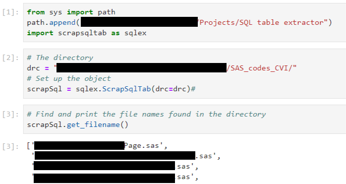

# Scraping table names from SQL queries in heterogeneous documents

    

A simple module to extract the table names in sql queries, encapsulated in heterogeneous documents. Thought to work with sas scripts but could work with other format as long as the queries are encapsulated or decorated with a start and end flags.

The process is the following:

    1. Walk the directory to find all files with the provided extension (default is ".sas")
    2. Look for start and end flags, for SAS, those are respectively, "proc sql" and "quit;"
    3. Extract the text between those flags
    4. Find the tables in the encapsulated SQL query by looking for keywords (select, from and join)
    5. Loop over all the instances in the file and loop over all files in the directory
    
   
Disclaimer: no guarantee that it is exhaustive unfortunatly. However the queries are stored in a dictionary for manual checks.

NB: If you want to parse pure SQL files, you better use [sql-metadata](https://github.com/macbre/sql-metadata) and [sqlparse](https://github.com/andialbrecht/sqlparse)

## How to use it

### Class

There is only one class `ScrapSqlTab()`

Inputs are:

 - drc: the directory path
 - extension: the file extension, default is `'.sas'`
 - start_flag: the flag marking the beginning of a SQL query in the heterogenous document (mixing different languages for instance). Default is `'proc sql'`
 - end_flag: the flag marking the end of a SQL query. Default is `'quit;'`

### Methods

The methods of the `ScrapSqlTab()` class are:

 - `get_filename` : get the file names in the specified directory
 - `tables_in_query` : look for the table names in a SQL query (but do not retrieve "created tables")
 - `get_tab` : apply the `tables_in_query` to all the queries found in a document
 - `get_tables_from_sas_scripts` : the main method, look for all the queries in all the documents in the directory and retrieve the table names, with schema names and store the queries as well for checking purpose.

### Example of use

    
    
    

